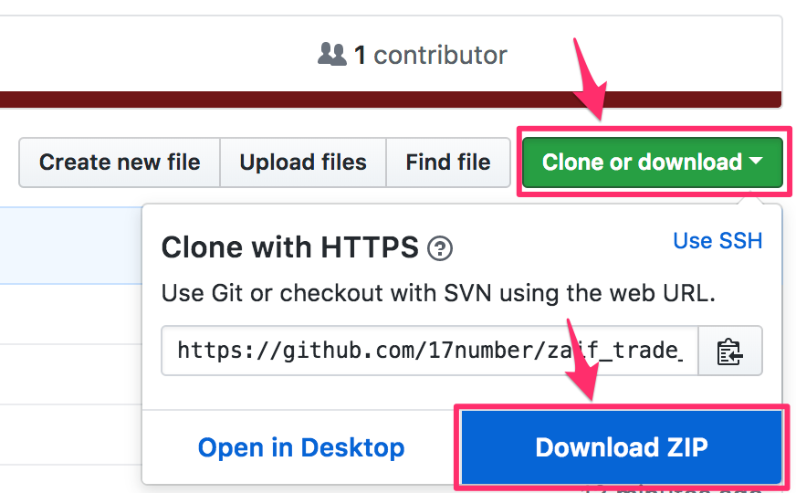
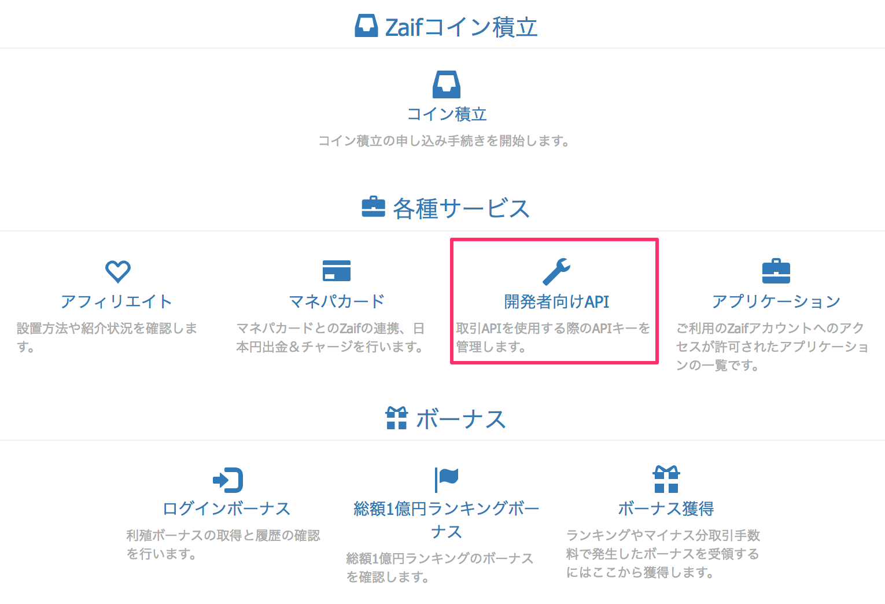
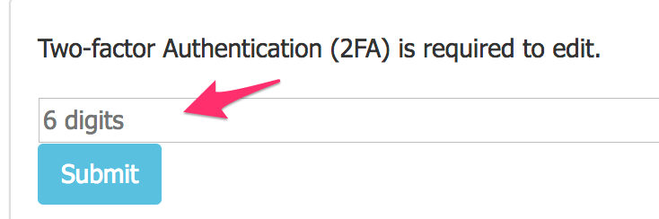
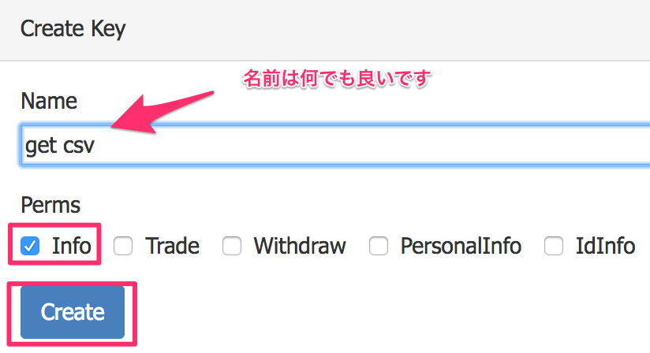
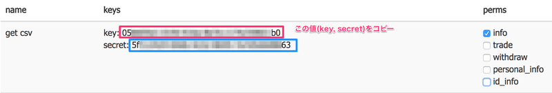
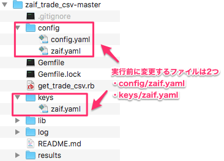
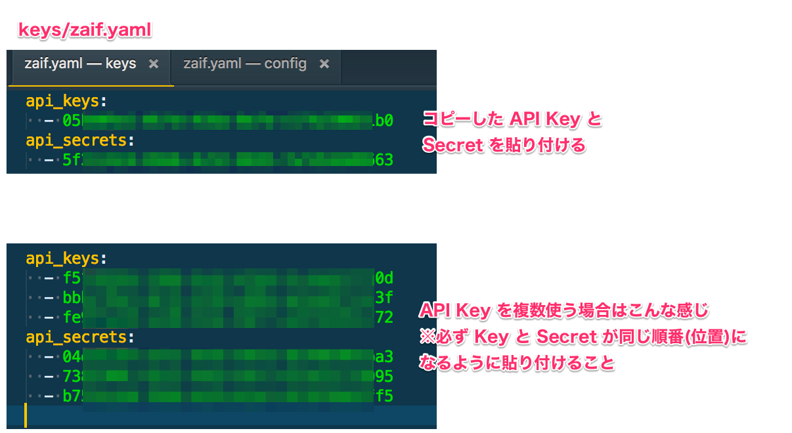
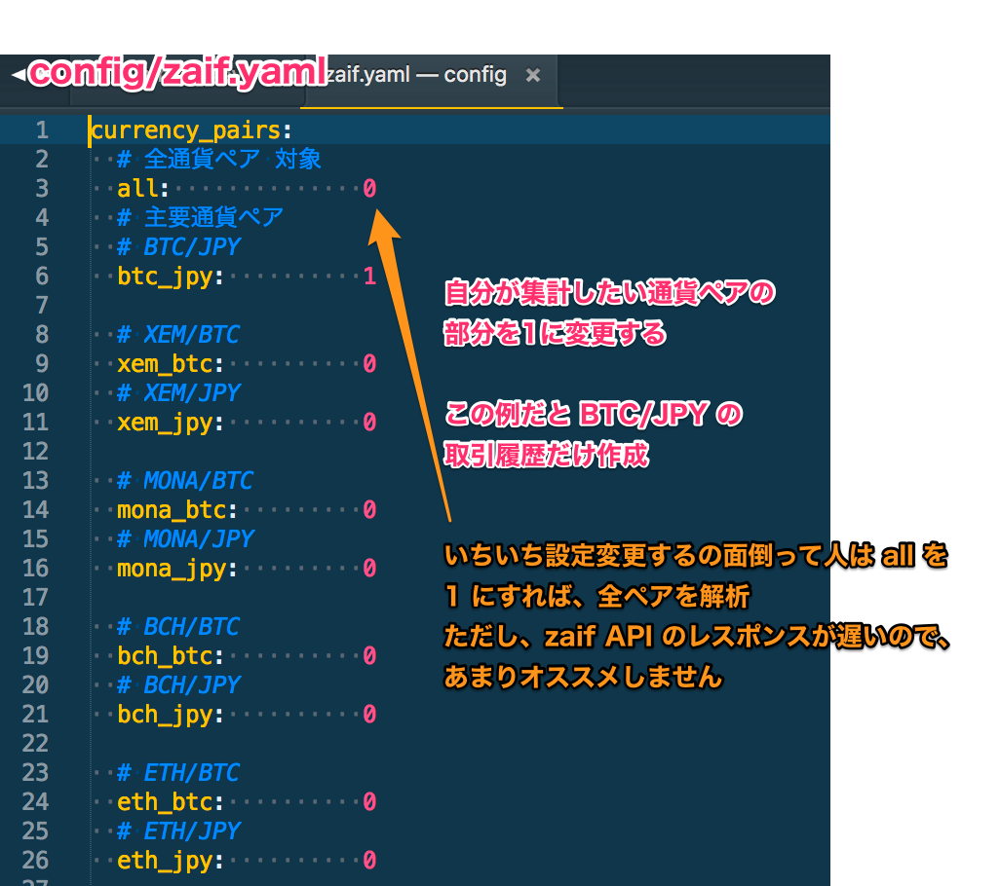
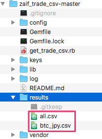
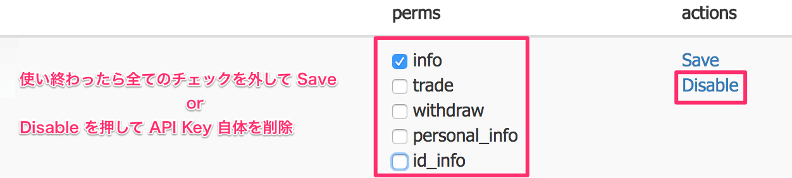

# このツールについて

zaif の取引履歴CSVを取得するためのツールです。API を使って取引履歴を取得、CSV形式に整形して出力します。


## 注意事項

- 本ツールの利用は自己責任でお願いします。確定申告で使ったら、数年後に追徴課税来た、とか言われても責任は負いかねます。
- その内、zaif さんが公式にCSVファイルの提供を開始すると思います。不安な方はそちらを待たれた方が良いです。
- API を使った不正出金が発生しているようなので、ツール利用後は API Key/Secret の削除や無効化を必ず行ってください。
- 「このツール使ったら資産とか情報とか抜かれるんじゃないの？」という方は、ソースコード眺めるなりして判断してください。ソースコード読めない(けど疑惑を感じる)という方は利用を見合わせてください。
  - 他ツールからコードを流用、かつ突貫で作ったのでコードは汚いと思います。温かく見守ってあげてください。
- 作成者の環境でしか動作確認できていません。環境によってはエラーが発生して、上手く動かない可能性もあります。
  - エラーが発生した場合は、github上でissueなり作成するか、[@stray_engineer](https://twitter.com/stray_engineer)までご連絡ください。
- 確認環境
  - macOS High Sierra v10.13.2
    - ruby v2.45.2p198
    - gem v2.6.13
    - Bundler v1.16.1
  - Windows 7 Pro SP1(64bit)
    - ruby v2.5.0p0
    - gem v2.7.4
    - Bundler v.1.16.1
- 2018/01/16 19:57 現在、**現物取引にしか対応しておりません**。ご了承ください。信用取引のCSVフォーマットが分かれば、対応するかもしれません。


## 寄付/投げ銭 大歓迎

このツールのおかげで助かりました、 ~~彼女ができました、~~ という方は[@stray_engineer](https://twitter.com/stray_engineer)にチップ投げてくれたり、
以下のアドレスに寄付してくれたりすると大変喜びます。

- BTC : 12Mg188NpkhtborkmW4gN36dxTTsdyvgSQ
- BCH : 12EzzGLuSavWL8YsMZmmeSV3SSU7hQFqtL
- ETH : 0x87b8ba3d2d43206ac7e911800e7b057f9598c27b
- mona : MV9zR6DKhscyhMQYtZgj1x4MjhSnCqwdXT
- XEM :
  - アドレス : NAGJG3-QFWYZ3-7LMI7I-QPSGQN-YADGSJ-ZGJRD2-DIYA
  - メッセージ : 5ea003c26771adde


## 使い方(初心者向け)
### Windows編
#### Ruby をインストール

[RubyInstaller](https://rubyinstaller.org/downloads/)から、最新版(2018/01/16 現在 v2.5.0-1)をダウンロードしてインストールする。
「x64 と x86 とあって良く分かんない」って方は x86 選んでおけば良いです。

基本的に実行したら、そのままポチポチ進んでいけば OK です。

以下の参考リンクも見ながら進めると安心です。

- 参考：[WindowsにRubyをインストールする\(初心者向け\) \- Qiita](https://qiita.com/shimoju/items/41035b213ad0ac3a979e)


#### Bundler をインストール

「Bundler って何？」と思いますよね？

Rubyで使う便利ツールです。気にしたら負けです。目的は CSV を作ることなんです。

1. コマンドプロンプトを起動
[Windows]キー と [r]キー を同時押しして、出てきたウィンドウに `cmd` って打ってください。

※Win8 以降でショートカットキーが変わってたらすみません。ググってください

2. インストール

```
gem install bundler
```

って打って Enter を押してください。あとは放っておけばインストールが完了するはずです。


#### ファイル一式をダウンロード

[17number/zaif\_trade\_csv: Zaifの取引履歴CSVをAPIで作成](https://github.com/17number/zaif_trade_csv) を開いて、
右の方にある「Clone or download」という緑色のボタンを押してください。ポップアップして表示される「Download ZIP」をクリック。



ダウンロード完了後、適当に展開してください。


#### コマンドプロンプトで移動

展開したフォルダに移動します。 `C:¥zaif_trade_csv-master` に展開した場合は、

```
cd C:¥zaif_trade_csv-master
```

と打てば移動できます。ディスクドライブが異なる場合は、

```
d:¥
```

と打てば Dドライブに移動できます。その後、展開したフォルダに移動してください。


#### ツールを動かすのに必要なファイルをインストール

コマンドプロンプトで以下を実行

```
bundle install --path vendor¥bundle
```


#### API Key を作成する

[Zaif の API Key のページ](https://zaif.jp/api_keys)に移動。リンクは怪しいから怖いって方は以下の手順で移動。




二段階認証を設定している場合は入力。



二段階認証パス後、現れる Create Key を入力して Create。名前は何でも良いです。必要な権限は Info のみ。(勝手に取引されたり、出金されたりする恐れはないから安心ですね！)



作成後、表示される Key/Secret をこのあと設定ファイルにコピーします。



取引履歴や通貨ペアが多い方は、同じ手順を繰り返して複数の Key/Secret を作っておくことをオススメします。


#### 設定ファイルの変更

以下の2ファイルを変更します。

- `keys¥zaif.yaml`
- `config¥zaif.yaml`




##### API Key/Secret 設定

`keys¥zaif.yaml` をテキストエディタで開きます。

前段で作成した Key/Secret をコピーして貼り付けます。



複数の Key/Secret を使う場合は、必要数分だけ行数を増やしてください。その際、必ず Key/Secret の順番が同じになるようにしてください。

※1番目の Key、1番目の Secret がペア、2番目の Key、2番目の Secret がペア…という感じになっています。


##### 通貨ペア 設定

`config¥zaif.yaml` をテキストエディタで開きます。

集計したい通貨ペアを探して `0` から `1` に変更します。



設定するのが面倒な方は `all` を `1` にすれば、全通貨ペアを対象に処理しますが、zaif API の反応が遅いのでちゃんと設定するのをオススメします。


#### いよいよ実行

ここまでお疲れ様でした。以下のコマンドをコマンドプロンプトで実行してください。

```
bundle exec ruby get_trade_csv.rb
```

実行完了後、`results` フォルダに CSV ファイルが出力されます。通貨ペアごと、および全通貨まとめたものがファイル出力されます。



念のため、[取引履歴ページ](https://zaif.jp/trade_log_btc_jpy/1)で内容に相違が無いか確認してください。


#### 後片付け(API Key/Secret の 削除or無効化)

API を使った不正出金など発生しているので、Key/Secret は削除しておきましょう。

[Zaif の API Key のページ](https://zaif.jp/api_keys)に移動して、二段階認証を実施。

チェックを外して Save するか、Disable を押して削除してください。




これで全て終了です、お疲れ様でした。

Ruby は入れておいても特に害はありません。が、気になる方は「Windows Ruby アンインストール」などでググって対応されてください。


### Mac OSX編

力尽きました_(:3」∠)_

- [\[Ruby入門\] 01\.導入（Macに最新版のRubyを入れる） \- Qiita](https://qiita.com/prgseek/items/ff037cc6134ff9303c67) あたりを参考にして、
Ruby をインストールしてください。
- 後の手順は Windows 編と同じです。コマンドプロンプトの代わりに、ターミナルを使っているだけです。頑張ってください。


## 使い方(上級者 ＝ Git/Ruby/Bundler などわかってる人 向け)
```bash
$ git clone https://github.com/17number/zaif_trade_csv.git
$ cd zaif_trade_csv
$ bundle install --path vendor/bundle
```

- API Key/Secret の 作成/設定(keys/zaif.yaml)
- 集計対象通貨ペアの設定(config/zaif.yaml)

```bash
$ bundle exec ruby get_trade_csv.rb
```
